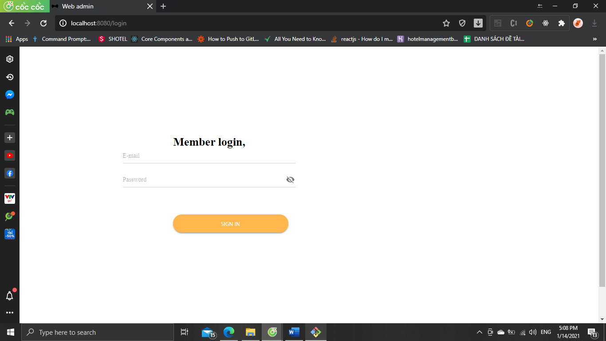

# Ứng dụng kinh doanh sách và văn phòng phẩm - Admin-Web

Ứng dụng giúp cho admin hệ thống quản lý các sản phẩm được up lên app và tài khoản người dùng 
(đi kèm với app di động tương ứng)

## Nội dung
1. [Chức năng](#chức-năng)

   1. [Đăng nhập](#đăng-nhập)

   1. [Quản lí sản phẩm người dùng](#quản-lí-sản-phẩm-người-dùng)
   
   1. [Quản lí tài khoản người dùng](#quản-lí-tài-khoản-người-dùng)
   
1. [Yêu cầu thiết bị](#yêu-cầu-thiết-bị)

1. [Thư viện và công nghệ](#thư-viện-và-công-nghệ)

1. [Tác giả](#tác-giả)

1. [Giấy phép](#giấy-phép)

1. [Cách cài đặt](#cách-cài-đặt)

## Chức năng
### Đăng nhập 

   

    
   

### Quản lí sản phẩm người dùng
   * Xem sản phẩm người dùng
  
   * Duyệt/Hủy duyệt sản phẩm

   * Xem thống kê 
   
   

    
   

      

    
   

 
### Quản lí tài khoản người dùng
   * Xem các tài khoản người dùng hệ thống 
  
   * Ban / Hủy ban các tài khoản người dùng

   
  

    
   

 
## Yêu cầu thiết bị
-Windows:

   +Windows : 10

   +Ram : 8.0 GB

## Thư viện và công nghệ

- Language : Javascript

- FrameWork : VueJs

- Backend: NodeJs + Express

- Database: MongoDb

* vuetify - https://github.com/vuetifyjs/vuetify

## Tác giả
Ngô Tấn Phát - 17520877@gm.uit.edu.vn

Phan Thanh Hoàng - 17520519@gm.uit.edu.vn

Trần Đình Thiện - 17521080@gm.uit.edu.vn

## Giấy phép

    Copyright 2020

    Licensed under the Apache License, Version 2.0 (the "License");
    you may not use this file except in compliance with the License.
    You may obtain a copy of the License at

       http://www.apache.org/licenses/LICENSE-2.0

    Unless required by applicable law or agreed to in writing, software
    distributed under the License is distributed on an "AS IS" BASIS,
    WITHOUT WARRANTIES OR CONDITIONS OF ANY KIND, either express or implied.
    See the License for the specific language governing permissions and
    limitations under the License.

## Cách cài đặt

- `yarn`
- `yarn serve`

